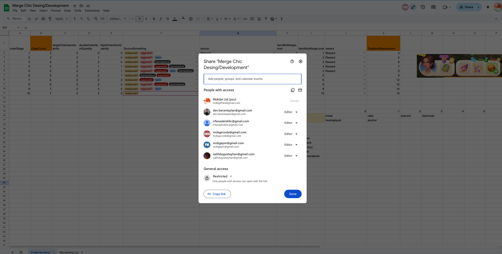
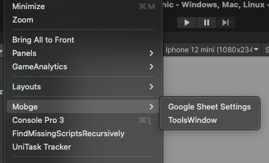
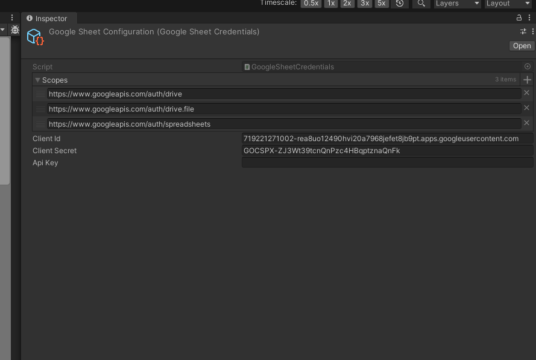
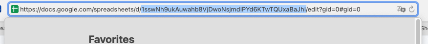
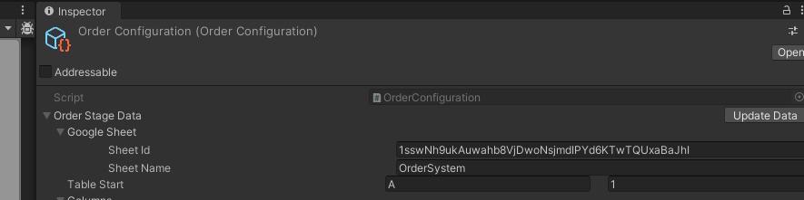
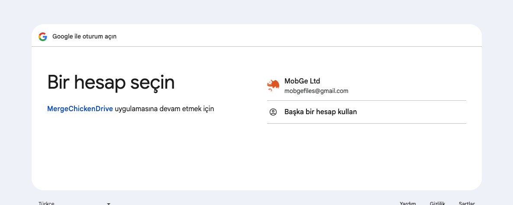
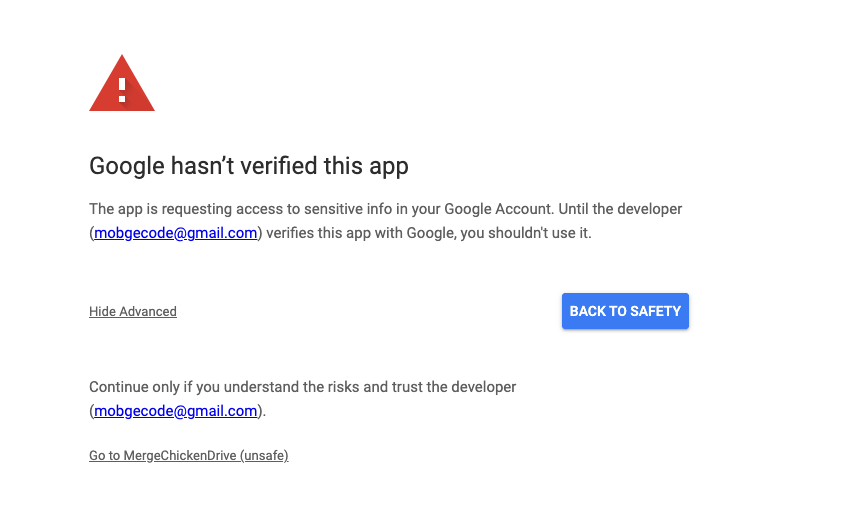
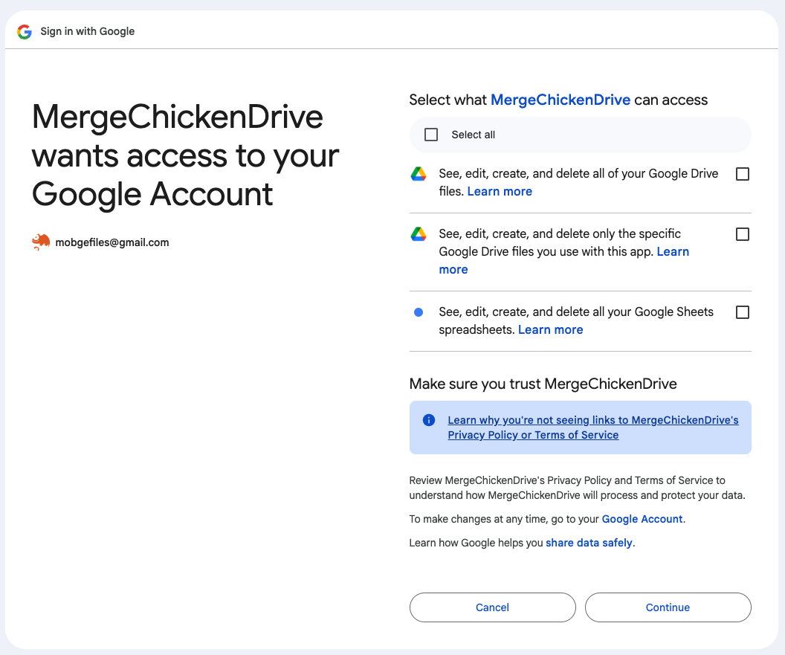
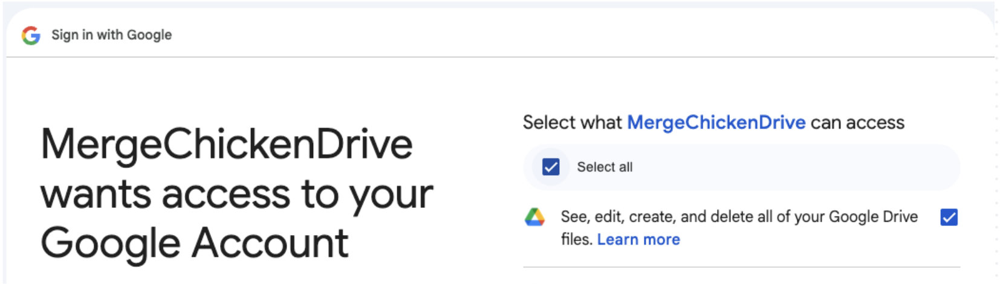

# MobgeSheets

A Unity plugin for importing and using Google Sheets data directly in your project.

## 1. Setup Instructions

### Google API Credentials
- Client ID:
  ```
  719221271002-rea8uo12490hvi20a7968jefet8jb9pt.apps.googleusercontent.com
  ```
- Client Secret:
  ```
  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
  ```

### Initial Configuration
1. **Grant Access Permission**
   
   Ensure access is granted to the email address of anyone who needs to use this system.

   

2. **Configure Google Sheet Integration**
   
   Add the client ID and secret to the Google Sheet scriptable object.

   
   

## 2. Creating Data Structures

### Code Setup

Create a data structure that matches your Google Sheet columns:

```csharp
[CreateAssetMenu(fileName = "ExampleConfig", menuName = "Game/ExampleConfig", order = 0)]
public class ExampleConfig : ScriptableObject
{
    // Reference to the sheet data
    public SheetData<DataEntry> entryData;

    public void Test()
    {
        // Access data from the sheet
        var value = entryData.data[0].valueA;
    }
}

[Serializable]
public struct DataEntry
{
    public int id;
    public int valueA;
    public int[] values;
    public string name;
    public float multiplier;
    public ItemSet.ItemPath item;
    public Sprite sprite;
    public ItemSet.ItemPath[] items;
}
```

### Sheet Configuration

1. **Get Sheet ID**
   
   The Sheet ID comes from your Google Sheet URL:

   
   

2. **Update Data Process**
   
   When you click the "Update Data" button, you'll be taken to your browser. Follow these required authentication steps:

   
   
   
   
   
   
   